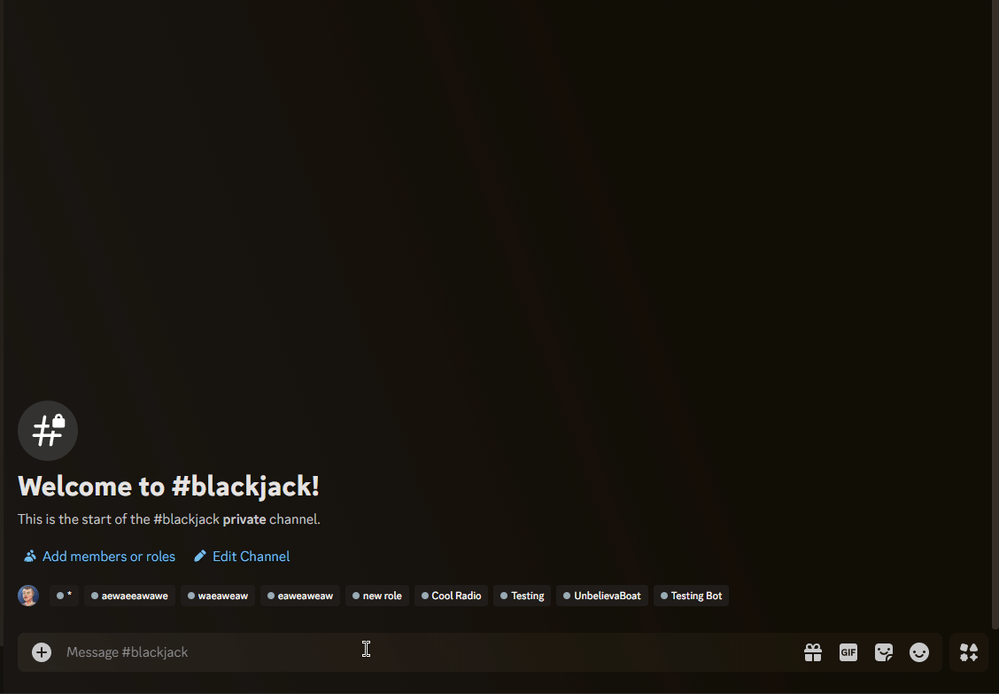

# blackjack-bot

A simple blackjack bot for Discord

## Features

* Play blackjack with the bot
* Can be played in user's DMs or in a server
* Slash commands
* Image generation for the board and cards

## Showcase

<p align="center">
  
</p>

## Installation

1. Clone the repository
2. Install the dependencies
3. Start the bot

```bash
git clone
bun install
bun start
```

This project was created using [djs-boilerplate](https://github.com/camdzic/djs-boilerplate).